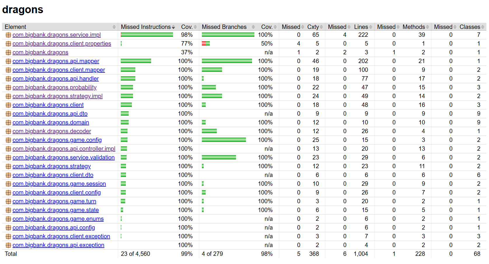

# Dragons of Mugloar

A full-stack take on the [Dragons of Mugloar](https://www.dragonsofmugloar.com/) game.
The backend wraps the upstream game API and adds a solver; the frontend lets you
play turn-by-turn or watch a bot play automatically.

- **Interactive play** — fetch ads, pick which to solve, buy shop items, track score/gold/lives, you can also pick a recommendation strategy.
- **Automatic play** — a strategy-driven bot that reliably reaches **1000+ points**, streamed live over SSE.

---

## Tech stack

**Backend**
- Java 25, Spring Boot 4.0.6
- Gradle 9.4.1, MapStruct 1.6.3
- springdoc-openapi 3.0.2, Spring core resilience (`@Retryable`)
- JaCoCo, Spotless + google-java-format, JUnit 5 + Mockito

**Frontend**
- Angular 21 — zoneless, signals, SSR
- TailwindCSS 4.3, Transloco, RxJS
- ESLint + angular-eslint, Prettier, Vitest

**Infra**
- Docker, Nginx, docker-compose

---

## Getting started

### Prerequisites
- **Docker path:** Docker Desktop only.
- **Local path:** JDK 25, Node 22+, npm.

### Run with Docker (recommended)
```bash
docker compose up --build -d
```
- UI → http://localhost
- API + Swagger → http://localhost:8080/swagger-ui.html

Stop:
```bash
docker compose down
```

### Run without Docker

**Backend** (port 8080):
```bash
cd dragons-backend
./gradlew bootRun
```
Swagger → http://localhost:8080/swagger-ui.html

**Frontend** (port 4200, proxies `/api` → 8080 via `proxy.conf.json`):
```bash
cd dragons-ui
npm ci
npm start
```
App → http://localhost:4200

### Tests
```bash
# backend: unit tests + coverage report (build/reports/jacoco)
cd dragons-backend && ./gradlew test jacocoTestReport


cd dragons-ui && npm test --watch=false
```

Some minor config and exception logic didn't get covered:


FE also has some tests but didn't focus on them a lot, basically services and main components are covered.

---

## Strategies:
 - expected-value: tries to pick the best risk for the reward - can sometimes fail really easily but 95% of the time produces better results than 'low-risk'
 - low-risk: lowest risk - also maximizes the value there - can be more stable than expected-value especially as a recommendation strategy for interactive mode


## Project layout

**Backend** (`dragons-backend/src/main/java/com/bigbank/dragons`)
```
api/          web layer — controllers (interface + impl), DTOs, OpenAPI config,
              exception handler (RFC 7807 ProblemDetail), MapStruct mappers
client/       upstream Mugloar integration — RestClient, retry, error translation
decoder/      ad de-obfuscation (Base64 / ROT13)
domain/       core domain records (Message, ShopItem, Board, TurnLog, ...)
game/         session store + TTL eviction, game state, turn execution, config
probability/  success-probability estimation
service/      orchestration (interactive, automatic, shop, task, stats) + validation
strategy/     pluggable solver strategies (expected-value, low-risk) + registry
```
33 test classes mirror the main packages.

**Frontend** (`dragons-ui/src/app`)
```
core/
  models/        TypeScript interfaces (RFC 7807 ProblemDetail included)
  services/      GameStore (signals + sessionStorage), InteractiveGame (REST),
                 AutoGame (REST + SSE), Transloco loader
  interceptors/  HTTP error interceptor
features/
  interactive/   interactive-page + game-log, player-stats components
  auto-runner/   auto-runner-page (SSE-driven live bot)
shared/
  components/    start-screen, stat-badge, error-banner, loading-spinner
```

---

## Key endpoints

| Method | Path | Purpose |
|--------|------|---------|
| GET  | `/api/games/play` | start a game |
| GET  | `/api/games/{id}/board` | list ads (optional `strategy` for a recommendation) |
| POST | `/api/games/{id}/solve` | attempt an ad |
| GET  | `/api/games/{id}/shop` | list shop items |
| POST | `/api/games/{id}/buy` | buy an item |
| GET  | `/api/games/{id}/state` | current state + full turn log |
| POST | `/api/play` | run one game to completion |
| POST | `/api/play/batch` | run N games concurrently, return aggregate stats |
| GET  | `/api/stream` | stream a game's turns live (SSE) |
| GET  | `/api/strategies` | available strategy keys |

---

## Configuration

Tunable in `dragons-backend/src/main/resources/application.yaml`:

- `game.target-score` (1000), `game.max-turns`, `game.strategy` (`expected-value` | `low-risk`)
- `game.thread-pool-size`, `game.batch-size` — batch concurrency
- `game.low-lives-threshold`, `game.healing-potion-max-cost`, `game.extra-lives-buffer` — solver tuning
- `game.session-ttl-minutes`, `game.session-eviction-rate-ms` — session lifecycle
- `mugloar.*` — upstream URL, timeouts, retry (`max-attempts`, backoff, jitter)

---

## Known issues & code smells

**Behavioural**
- **Turn log can cause RAM buildup.** `GameState` keeps an unbounded `List<TurnLog>`
  (up to `max-turns` per game). Many concurrent/long sessions grow heap until TTL
  eviction.
- **`play` and `stream` are separate endpoints.** `/api/play` (blocking, returns the
  final result) and `/api/stream` (SSE, per-turn) duplicate the game loop in
  `AutomaticGameRunnerServiceImpl`.
- **`playBatch` downstream errors are swallowed.** `playGameSafely` catches every
  exception per game (so one rate-limited game doesn't fail the batch). Trade-off:
  upstream failures (e.g. 429) are logged and the game skipped, never surfaced to the
  caller — `BatchStats` silently reflects fewer games. No per-game error reporting.
- **Short session TTL.** `session-ttl-minutes: 1` — a finished game's log is only
  viewable for ~1 min after last access. It can be turned up, but I stayed with this.
- **SSE error vs. completion is ambiguous.** `EventSource` can't read HTTP status, so
  the backend sends an explicit `failed` event -> a raw network drop still looks like a normal end-of-game.

**Maintainability**
- `LowRiskStrategy` and `ExpectedValueStrategy` duplicate most of `choosePurchases`
  (differs only in threshold and sort order) — extract a shared base.
- **Frontend:** `PlayerStats` is imported cross-feature (interactive → auto-runner);
  the live-log table duplicates `game-log`'s markup (extract a `TurnLogTable`); page
  subscriptions don't use `takeUntilDestroyed`.

---

## Limitations
- **Bound to one upstream.** All play depends on `dragonsofmugloar.com`; its rate
  limits cap throughput. Retry + jitter soften this but can't remove it. - Can be a problem in batch play.

---

## Requirements checklist

- [x] Start a game, fetch & display ads, solve ads, buy shop items
- [x] Display score / gold / lives
- [x] State management (Angular signals via `GameStore`)
- [x] Reaches 1000+ points automatically
- [x] Error handling (RFC 7807 ProblemDetail, upstream retry/translation, input validation)
- [x] Responsive + cross-browser (Tailwind, SSE with fallbacks)
- [x] Unit tests (backend JUnit/Mockito + JaCoCo; frontend Vitest)
